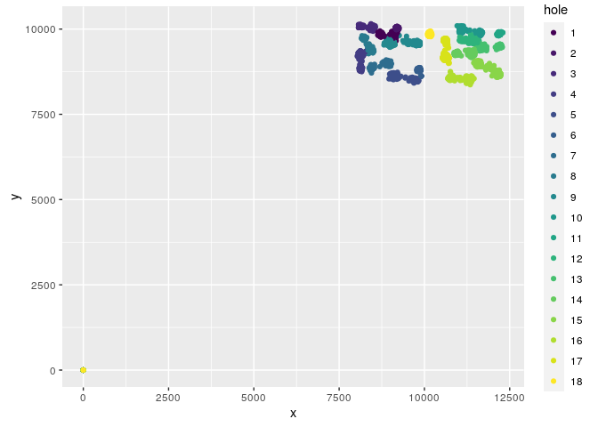
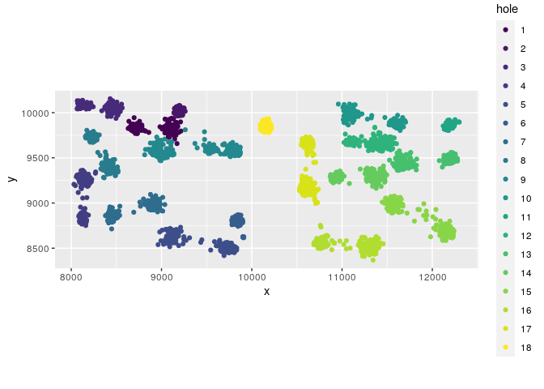
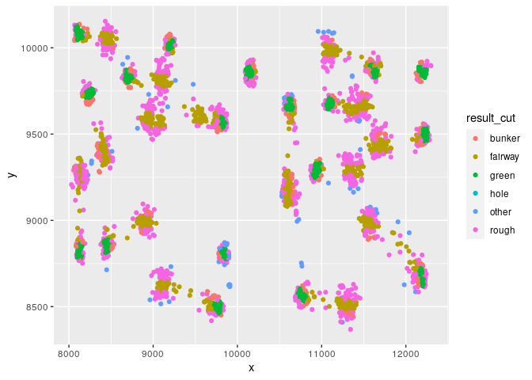
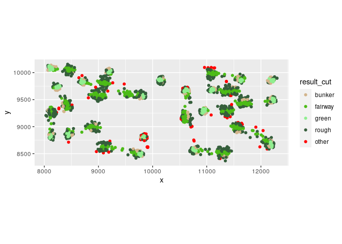
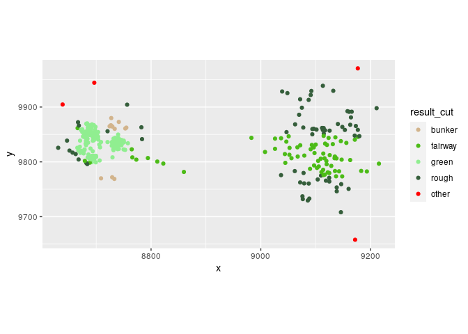

Exploring [PGA
ShotLink](https://www.pgatour.com/stats/shotlinkintelligence/overview.html)
================

Take a look at the data

Three data sets

check out stroke level

``` r
library(tidyverse)

stroke_level_import = read.delim(file = "~/project/data/sample_download/StrokeLevelTOURChamp.txt")

stroke_level_import %>% 
  str()
```

    ## 'data.frame':    8422 obs. of  38 variables:
    ##  $ tour_code                      : chr  "R" "R" "R" "R" ...
    ##  $ tour_description               : chr  "PGA TOUR" "PGA TOUR" "PGA TOUR" "PGA TOUR" ...
    ##  $ year                           : int  2011 2011 2011 2011 2011 2011 2011 2011 2011 2011 ...
    ##  $ tourn_num                      : int  410 410 410 410 410 410 410 410 410 410 ...
    ##  $ Player..                       : int  1810 1810 1810 1810 1810 1810 1810 1810 1810 1810 ...
    ##  $ Course..                       : int  688 688 688 688 688 688 688 688 688 688 ...
    ##  $ Permanent.Tournament..         : int  60 60 60 60 60 60 60 60 60 60 ...
    ##  $ Player.First.Name              : chr  "Phil" "Phil" "Phil" "Phil" ...
    ##  $ Player.Last.Name               : chr  "Mickelson" "Mickelson" "Mickelson" "Mickelson" ...
    ##  $ Round                          : int  1 1 1 1 1 1 1 1 1 1 ...
    ##  $ Tournament.Name                : chr  "TOUR Championship by Coca-Cola" "TOUR Championship by Coca-Cola" "TOUR Championship by Coca-Cola" "TOUR Championship by Coca-Cola" ...
    ##  $ Course.Name                    : chr  "East Lake GC" "East Lake GC" "East Lake GC" "East Lake GC" ...
    ##  $ Hole                           : int  1 1 1 1 2 2 3 3 3 3 ...
    ##  $ Hole.Score                     : int  4 4 4 4 2 2 4 4 4 4 ...
    ##  $ Par.Value                      : int  4 4 4 4 3 3 4 4 4 4 ...
    ##  $ Yardage                        : int  424 424 424 424 214 214 387 387 387 387 ...
    ##  $ Shot                           : int  1 2 3 4 1 2 1 2 3 4 ...
    ##  $ Shot.Type.S.P.D.               : chr  "S" "S" "S" "S" ...
    ##  $ X..of.Strokes                  : int  1 1 1 1 1 1 1 1 1 1 ...
    ##  $ From.Location.Scorer.          : chr  "Tee Box" "Primary Rough" "Green" "Green" ...
    ##  $ From.Location.Laser.           : chr  "" "Right Rough" "Unknown" "Unknown" ...
    ##  $ To.Location.Scorer.            : chr  "Primary Rough" "Green" "Green" "" ...
    ##  $ To.Location.Laser.             : chr  "Right Rough" "Unknown" "Unknown" "" ...
    ##  $ Distance                       : int  10677 4932 326 39 7727 231 10069 3309 150 14 ...
    ##  $ Distance.to.Pin                : int  15444 4788 281 39 7812 231 13464 3440 132 14 ...
    ##  $ In.the.Hole.Flag               : chr  "N" "N" "N" "Y" ...
    ##  $ Around.the.Green.Flag          : chr  "N" "N" "N" "N" ...
    ##  $ X1st.Putt.Flag                 : chr  "" "" "Y" "" ...
    ##  $ Distance.to.Hole.after.the.Shot: int  4788 281 39 0 231 0 3440 132 14 0 ...
    ##  $ Time                           : int  1255 1300 1304 1305 1307 1312 1315 1320 1324 1324 ...
    ##  $ Lie                            : chr  "Good" "N/A" "Good" "Good" ...
    ##  $ Elevation                      : chr  "With" "With" "With" "With" ...
    ##  $ Slope                          : chr  "Level" "Level" "Level" "Level" ...
    ##  $ X.Coordinate                   : chr  "9,093.97" "8,683.75" "8,697.45" "0" ...
    ##  $ Y.Coordinate                   : chr  "9,859.90" "9,868.71" "9,845.29" "0" ...
    ##  $ Z.Coordinate                   : num  480 504 504 0 491 ...
    ##  $ Distance.from.Center           : int  562 232 33 0 214 0 127 15 2 0 ...
    ##  $ Distance.from.Edge             : int  126 25 199 0 347 0 344 32 140 0 ...

Cool data, want to fix column names

``` r
library(janitor)

stroke_level_clean_names = stroke_level_import %>% 
  clean_names()


stroke_level_clean_names %>% 
  colnames()
```

    ##  [1] "tour_code"                       "tour_description"               
    ##  [3] "year"                            "tourn_num"                      
    ##  [5] "player"                          "course"                         
    ##  [7] "permanent_tournament"            "player_first_name"              
    ##  [9] "player_last_name"                "round"                          
    ## [11] "tournament_name"                 "course_name"                    
    ## [13] "hole"                            "hole_score"                     
    ## [15] "par_value"                       "yardage"                        
    ## [17] "shot"                            "shot_type_s_p_d"                
    ## [19] "x_of_strokes"                    "from_location_scorer"           
    ## [21] "from_location_laser"             "to_location_scorer"             
    ## [23] "to_location_laser"               "distance"                       
    ## [25] "distance_to_pin"                 "in_the_hole_flag"               
    ## [27] "around_the_green_flag"           "x1st_putt_flag"                 
    ## [29] "distance_to_hole_after_the_shot" "time"                           
    ## [31] "lie"                             "elevation"                      
    ## [33] "slope"                           "x_coordinate"                   
    ## [35] "y_coordinate"                    "z_coordinate"                   
    ## [37] "distance_from_center"            "distance_from_edge"

Convert coordinates to numbers

``` r
stroke_level_num_coords = stroke_level_clean_names %>% 
  mutate(x = str_replace_all(string = x_coordinate,
                             pattern = ",",
                             replacement = "")) %>%
  mutate(y = str_replace_all(string = y_coordinate,
                             pattern = ",",
                             replacement = "")) %>% 
  mutate(z = str_replace_all(string = z_coordinate,
                             pattern = ",",
                             replacement = "")) %>% 
  mutate(x = as.numeric(x),
         y = as.numeric(y),
         z = as.numeric(z)) %>% 
  select(-x_coordinate, 
         -y_coordinate, 
         -z_coordinate)

stroke_level_num_coords %>% 
  select(x,y,z) %>% 
  as_tibble() %>% 
  head(20)
```

    ## # A tibble: 20 × 3
    ##        x      y     z
    ##    <dbl>  <dbl> <dbl>
    ##  1 9094.  9860.  480.
    ##  2 8684.  9869.  504.
    ##  3 8697.  9845.  504.
    ##  4    0      0     0 
    ##  5 9212. 10025.  491.
    ##  6    0      0     0 
    ##  7 8448. 10052.  508.
    ##  8 8173. 10069.  521.
    ##  9 8161. 10071.  522.
    ## 10    0      0     0 
    ## 11 8175.  9314.  514.
    ## 12 8087.  8863.  524.
    ## 13 8114.  8842.  528.
    ## 14    0      0     0 
    ## 15 8962.  8540.  507.
    ## 16 9160.  8558.  493.
    ## 17 9670.  8509.  482.
    ## 18 9717.  8515.  484.
    ## 19    0      0     0 
    ## 20 9825   8826.  476.

Notice that there are zeros, want to take a look at the data,

``` r
stroke_level_num_coords %>% 
  mutate(hole = factor(hole, ordered = T)) %>% 
  ggplot(mapping = aes(x = x,
                       y = y,
                       color = hole)) +
  geom_point() +
  coord_equal(clip = "off") +
  theme()
```

<!-- -->

Really encouraging except for the zeros

``` r
n_zeros = stroke_level_num_coords %>% 
  filter(x == 0) %>% 
  as.data.frame() %>% 
  nrow()

n_zeros/nrow(stroke_level_num_coords)
```

    ## [1] 0.259677

What are the zeros?

``` r
stroke_level_num_coords %>% 
  select(round,
         hole,
         player,
         shot,
         x) %>% 
  arrange(round,
          hole,
          player,
          shot) %>% 
  as.data.frame() %>% 
  head(25)
```

    ##    round hole player shot       x
    ## 1      1    1   1810    1 9093.97
    ## 2      1    1   1810    2 8683.75
    ## 3      1    1   1810    3 8697.45
    ## 4      1    1   1810    4    0.00
    ## 5      1    1   2206    1 9148.35
    ## 6      1    1   2206    2 8692.03
    ## 7      1    1   2206    3 8695.46
    ## 8      1    1   2206    4    0.00
    ## 9      1    1   6527    1 9071.90
    ## 10     1    1   6527    2 8685.15
    ## 11     1    1   6527    3    0.00
    ## 12     1    1   6567    1 9132.12
    ## 13     1    1   6567    2 8727.09
    ## 14     1    1   6567    3 8694.49
    ## 15     1    1   6567    4    0.00
    ## 16     1    1  20645    1 9087.41
    ## 17     1    1  20645    2 8729.70
    ## 18     1    1  20645    3 8699.08
    ## 19     1    1  20645    4    0.00
    ## 20     1    1  21731    1 9097.11
    ## 21     1    1  21731    2 8689.63
    ## 22     1    1  21731    3 8696.71
    ## 23     1    1  21731    4    0.00
    ## 24     1    1  21878    1 9066.71
    ## 25     1    1  21878    2 8682.88

These are shots that finish in the hole, READ THE DOCS, convert to NAs

``` r
stroke_level_no_zeros = stroke_level_num_coords %>% 
  mutate(x = ifelse(x == 0,NA,x)) %>% 
  mutate(y = ifelse(y == 0,NA,y)) %>% 
  mutate(z = ifelse(z == 0,NA,z)) 
```

Plot it again

``` r
stroke_level_no_zeros %>% 
  mutate(hole = factor(hole, ordered = T)) %>%
  ggplot(mapping = aes(x = x,
                       y = y,
                       color = hole)) +
  geom_point() +
  coord_equal(clip = "off") +
  theme()
```

    ## Warning: Removed 2187 rows containing missing values (geom_point).

<!-- -->

Plot the cut

``` r
stroke_level_no_zeros %>% 
  group_by(to_location_scorer,
           to_location_laser) %>% 
  summarize(shots = n()) %>% 
  as.data.frame() %>% 
  arrange(to_location_scorer,
          to_location_laser)
```

    ##    to_location_scorer              to_location_laser shots
    ## 1                                                     2175
    ## 2        Dirt Outline                        Unknown     1
    ## 3             Fairway                   Left Fairway   578
    ## 4             Fairway                  Right Fairway   551
    ## 5      Fairway Bunker                        Unknown    92
    ## 6              Fringe                   Left Fairway     2
    ## 7              Fringe                  Right Fairway     2
    ## 8               Green                        Unknown  3558
    ## 9   Green Side Bunker Front Center Green Side Bunker    34
    ## 10  Green Side Bunker   Front Left Green Side Bunker    60
    ## 11  Green Side Bunker         Left Green Side Bunker    47
    ## 12  Green Side Bunker    Left Rear Green Side Bunker     3
    ## 13  Green Side Bunker  Right Front Green Side Bunker    66
    ## 14  Green Side Bunker        Right Green Side Bunker    77
    ## 15  Green Side Bunker   Right Rear Green Side Bunker     1
    ## 16 Intermediate Rough              Left Intermediate   112
    ## 17 Intermediate Rough             Right Intermediate   145
    ## 18      Primary Rough                     Left Rough   436
    ## 19      Primary Rough                    Right Rough   401
    ## 20       Tree Outline                        Unknown    24
    ## 21            Unknown                        Unknown    21
    ## 22              Water                        Unknown    23
    ## 23         Water Drop                        Unknown    13

``` r
stroke_level_with_cut = stroke_level_no_zeros %>% 
  mutate(result_cut = case_when(to_location_scorer == 'Fairway' ~ 'fairway',
                                to_location_scorer %in% c('Fairway Bunker', 'Green Side Bunker') ~ 'bunker',
                                to_location_scorer %in% c('Intermediate Rough','Primary Rough') ~ 'rough',
                                to_location_scorer == 'Green' ~ 'green',
                                is.na(x) ~ 'hole',
                                T ~ 'other'))


stroke_level_with_cut$result_cut %>% 
  table()
```

    ## .
    ##  bunker fairway   green    hole   other   rough 
    ##     380    1129    3558    2176      85    1094

``` r
stroke_level_with_cut %>% 
  ggplot(mapping = aes(x = x,
                       y = y,
                       color = result_cut)) +
  geom_point()
```

    ## Warning: Removed 2187 rows containing missing values (geom_point).

<!-- -->

``` r
result_cut_colors = c('bunker'='tan',
                      'fairway'='#4CBB17',
                      'green'='#90EE90',
                      'rough'='#355E3B',
                      'other'='red')


stroke_level_with_cut %>% 
  ggplot(mapping = aes(x = x,
                       y = y,
                       color = result_cut)) +
  geom_point() +
  scale_color_manual(values = result_cut_colors) +
  coord_equal()
```

    ## Warning: Removed 2187 rows containing missing values (geom_point).

<!-- -->

``` r
stroke_level_with_cut %>% 
  filter(hole == 1) %>% 
  ggplot(mapping = aes(x = x,
                       y = y,
                       color = result_cut)) +
  geom_point() +
  scale_color_manual(values = result_cut_colors) +
  coord_equal()
```

    ## Warning: Removed 120 rows containing missing values (geom_point).

<!-- -->

Going to add these cleaning steps to a function
