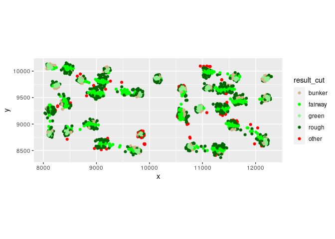

Ball Location Classifier
================

``` r
library(tidyverse)

source("~/project/functions/prepare_shot_data.R")

source("~/project/functions/plot_shot_data.R")

shot_data = prepare_shot_data()

hole_one = shot_data %>% 
  filter(hole == 1)

plot_shot_data(hole_one)
```

    ## Warning: Removed 120 rows containing missing values (geom_point).

<!-- -->
