Fairway Classifier
================

-   [Load data and functions](#load-data-and-functions)
-   [Train model](#train-model)

# Load data and functions

``` r
library(tidyverse)

library(caret)

library(recipes)

source("~/project/functions/prepare_shot_data.R")

source("~/project/functions/plot_shot_data.R")

source("~/project/utils/result_cut_colors.R")

shot_data = prepare_shot_data()

plot_shot_data(shot_data)
```

    ## Warning: Removed 2187 rows containing missing values (geom_point).

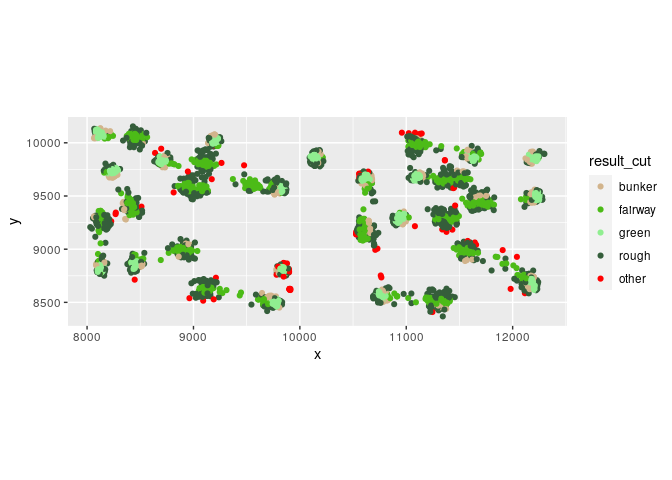<!-- -->

# Train model

``` r
train_data = shot_data %>% 
  filter(!is.na(result_cut),
         !is.na(x),
         !is.na(y)) %>% 
  mutate(result_cut = factor(result_cut))

ctrl = trainControl(method = "cv",
                    savePredictions = "final",
                    allowParallel = TRUE,
                    classProbs = TRUE)

tune_grid = data.frame(k = 3:8)

trained_model = caret::train(result_cut ~ x + y,
                             data = train_data,
                             method = "knn",
                             trControl = ctrl,
                             tuneGrid = tune_grid)

resample_preds = trained_model$pred %>% 
  arrange(rowIndex) %>% 
  select(pred,
         obs) %>% 
  mutate(correct = ifelse(pred == obs,'yes','no')) %>% 
  select(-obs)

train_with_resample_preds = bind_cols(train_data,
                                      resample_preds)


plot_tee_shot = function(hole_num = 5) {
  
  hole_shots = train_with_resample_preds %>% 
    filter(hole == hole_num,
           shot == 1) %>% 
    filter(!is.na(x)) %>% 
    select(x,
           y,
           result_cut,
           pred,
           correct) %>% 
    mutate(data_type = 'acutal_shots')
  
  accuracy = hole_shots %>% 
    group_by(correct) %>% 
    summarize(n = n()) %>% 
    pivot_wider(names_from = correct,
                values_from = n) %>% 
    mutate(accuracy = yes/(yes + no)) %>% 
    pull(accuracy)
  
  hole_min_x = min(hole_shots$x)
  
  hole_max_x = max(hole_shots$x)
  
  hole_min_y = min(hole_shots$y)
  
  hole_max_y = max(hole_shots$y)
  
  grid_space = 3
  
  hole_grid = expand.grid(x = seq(hole_min_x, hole_max_x, grid_space),
                          y = seq(hole_min_y, hole_max_y, grid_space))
  
  hole_grid$prediction = predict(trained_model, newdata = hole_grid)
  
  hole_grid$data_type = 'classifier'
  
  hole_par_value = train_with_resample_preds %>% 
    filter(hole == hole_num) %>% 
    pull(par_value) %>% 
    unique()
  
  plot_title = paste0("Tee Shot | Hole ",hole_num," | Par ",hole_par_value)
  
  plot_subtitle = paste0("Out-of-sample Accuracy = ", scales::percent(accuracy))
  
  ggplot() +
    geom_tile(data = hole_grid,
               mapping = aes(x = x,
                             y = y,
                             fill = prediction),
              alpha = 0.4) +
    geom_point(data = hole_shots,
               mapping = aes(x = x,
                             y = y,
                             color = result_cut,
                             shape = correct)) +
    # facet_wrap(vars(data_type)) +
    coord_equal() +
    labs(title = plot_title,
         subtitle = plot_subtitle) +
    scale_color_manual(values = result_cut_colors) +
    scale_fill_manual(values = result_cut_colors) +
    scale_shape_manual(values = c('yes'=19,'no'=4)) + 
    theme(legend.position = "right",
          axis.text = element_blank(),
          axis.ticks = element_blank(),
          panel.grid = element_blank(),
          panel.background = element_blank(),
          axis.title = element_blank()) +
    guides(fill = "none")
  

}

1:18 %>%
    map(.f = plot_tee_shot)
```

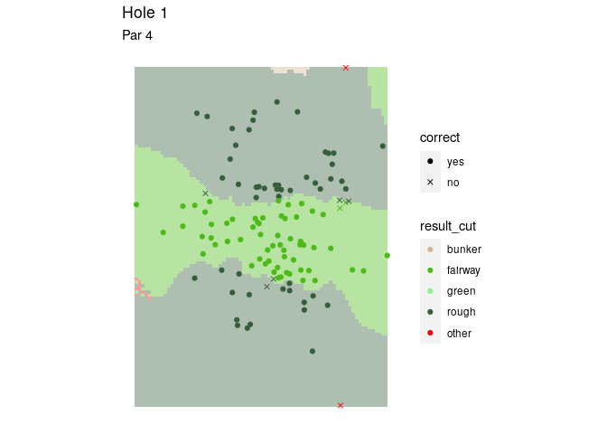<!-- -->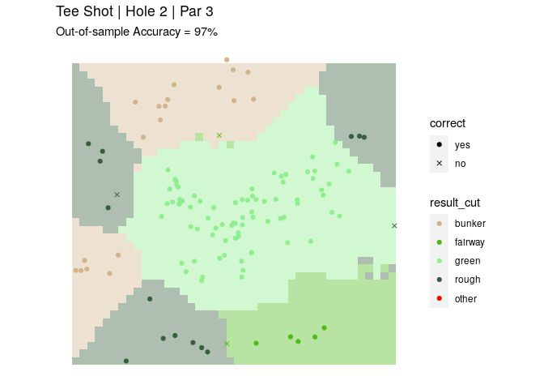<!-- -->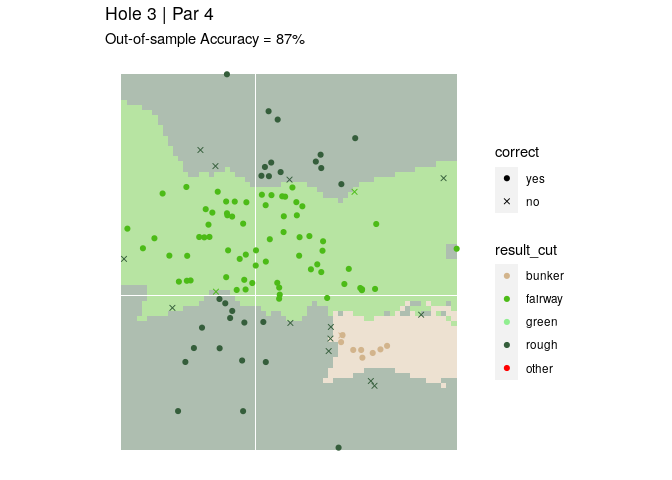<!-- -->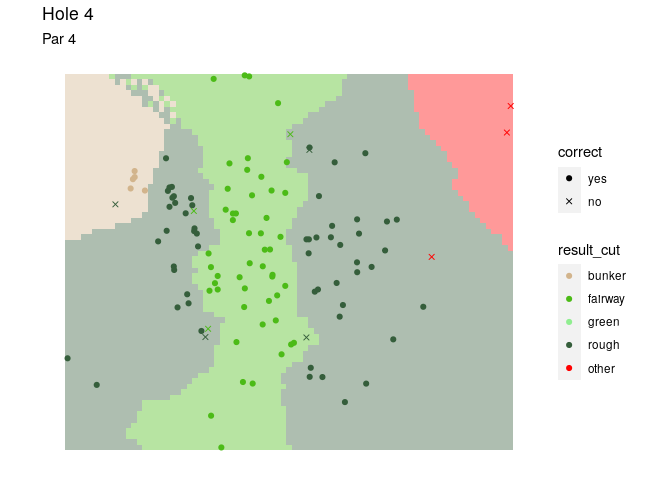<!-- -->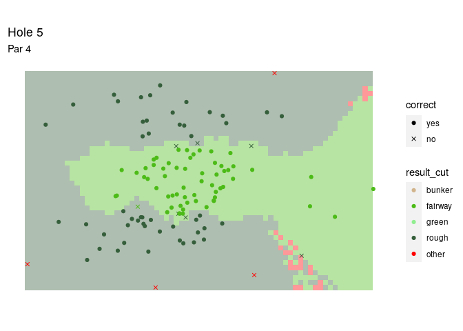<!-- -->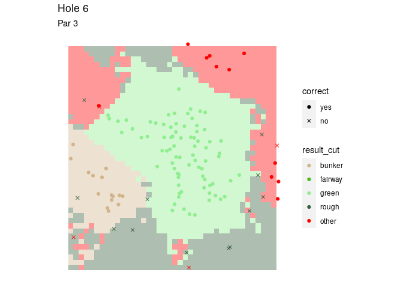<!-- -->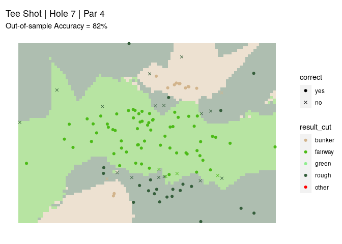<!-- -->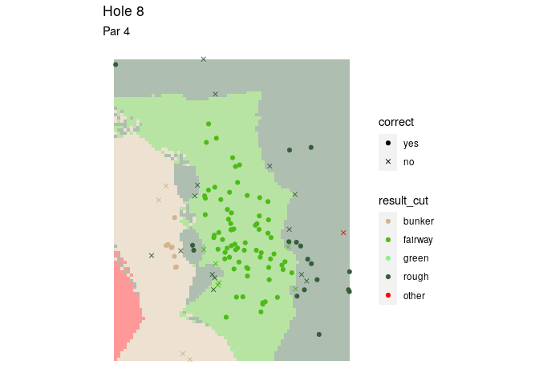<!-- -->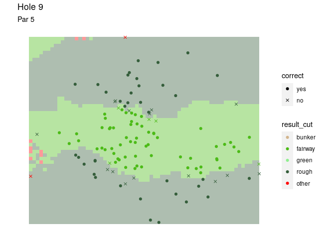<!-- -->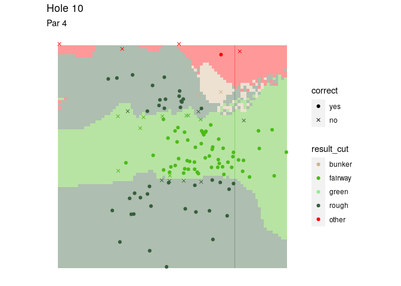<!-- -->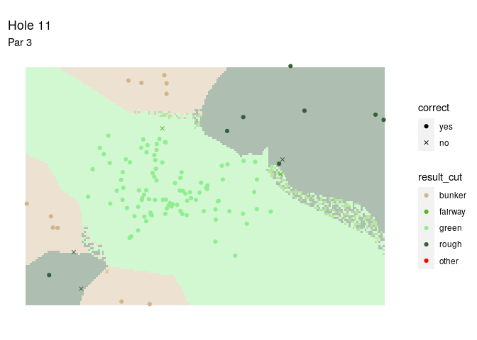<!-- -->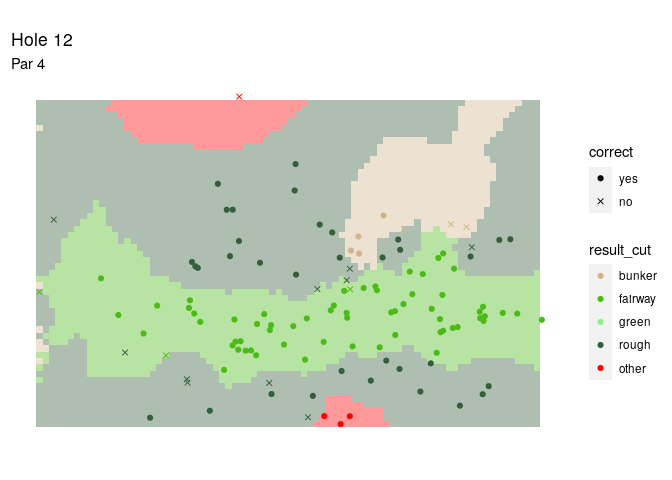<!-- -->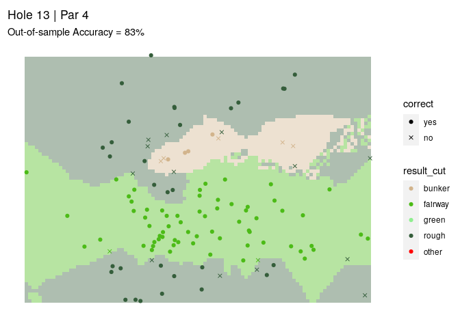<!-- -->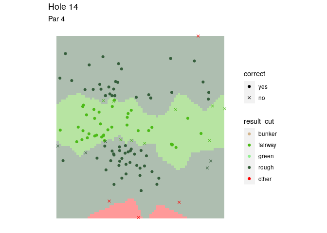<!-- -->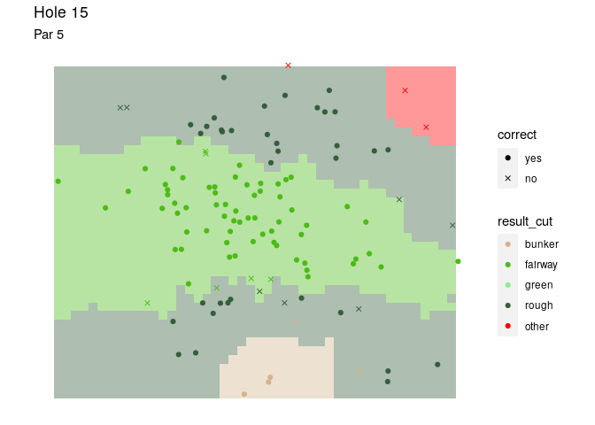<!-- -->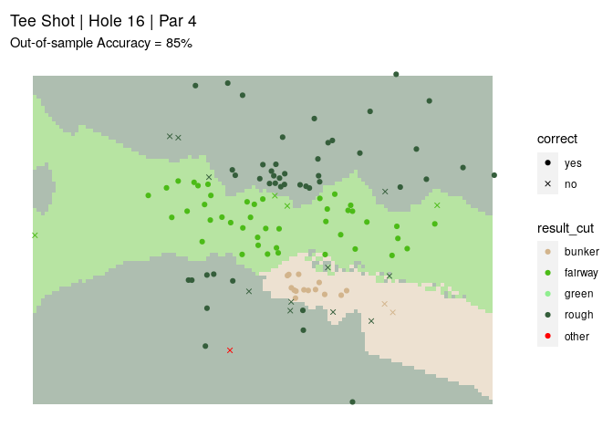<!-- -->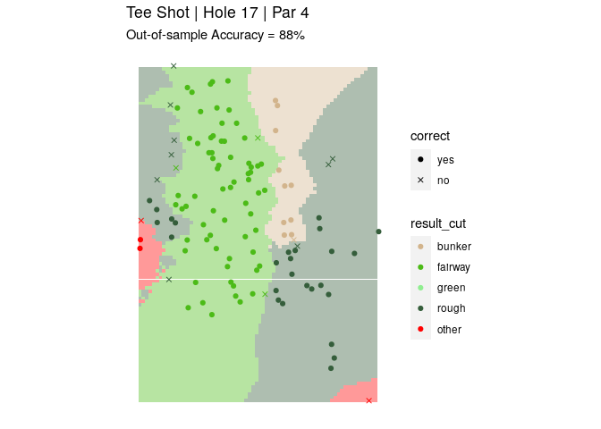<!-- -->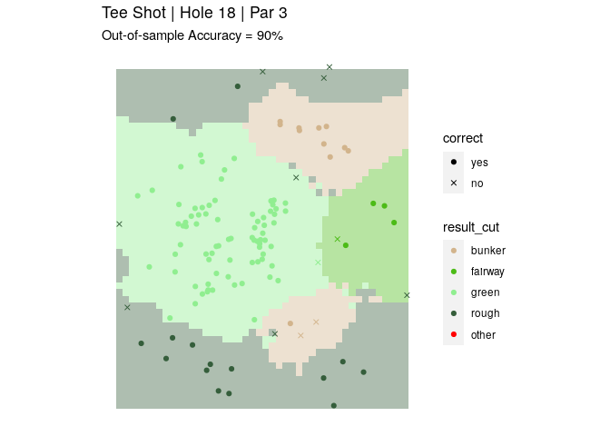<!-- -->
