Fairway Classifier
================

``` r
library(tidyverse)

library(caret)

library(recipes)

source("~/project/functions/prepare_shot_data.R")

source("~/project/functions/plot_shot_data.R")

shot_data = prepare_shot_data()

plot_shot_data(shot_data)
```

    ## Warning: Removed 2187 rows containing missing values (geom_point).

<!-- -->

``` r
train_data = shot_data %>% 
  select(result_cut, x, y) %>% 
  filter(!is.na(result_cut),
         !is.na(x),
         !is.na(y)) %>% 
  mutate(result_cut = factor(result_cut))

ctrl = trainControl(method = "cv",
                    savePredictions = "final",
                    allowParallel = TRUE,
                    classProbs = TRUE)

tune_grid = data.frame(k = 3:8)

trained_model = caret::train(result_cut ~ x + y,
                             data = train_data,
                             method = "knn",
                             trControl = ctrl,
                             tuneGrid = tune_grid)

plot_tee_shot = function(hole_num = 5) {
  
  hole_shots = shot_data %>% 
    filter(hole == hole_num,
           shot == 1
           ) %>% 
    filter(!is.na(x)) %>% 
    select(result_cut,
           x,
           y) %>% 
    mutate(data_type = 'shot')
  
  hole_min_x = min(hole_shots$x)
  
  hole_max_x = max(hole_shots$x)
  
  hole_min_y = min(hole_shots$y)
  
  hole_max_y = max(hole_shots$y)
  
  grid_space = 10
  
  hole_grid = expand.grid(x = seq(hole_min_x, hole_max_x, grid_space),
                          y = seq(hole_min_y, hole_max_y, grid_space))
  
  hole_grid$result_cut = predict(trained_model, newdata = hole_grid)
  
  hole_grid$data_type = 'prediction'
  
  plot_data_long = hole_shots %>% 
    bind_rows(hole_grid)
  
  result_cut_colors = c('bunker'='tan',
                        'fairway'='green',
                        'green'='lightgreen',
                        'rough'='darkgreen',
                        'other'='red')
  
  ggplot() +
    geom_tile(data = hole_grid,
               mapping = aes(x = x,
                             y = y,
                             fill = result_cut),
              alpha = 0.3) +
    geom_point(data = hole_shots,
               mapping = aes(x = x,
                             y = y,
                             color = result_cut)) +
    facet_wrap(vars(data_type)) +
    coord_equal() +
    scale_color_manual(values = result_cut_colors) +
    scale_fill_manual(values = result_cut_colors) +
    theme(legend.position = "bottom",
          axis.text = element_blank(),
          axis.ticks = element_blank(),
          panel.grid = element_blank(),
          panel.background = element_blank(),
          axis.title = element_blank())
  

}

1:18 %>%
    map(.f = plot_tee_shot)
```

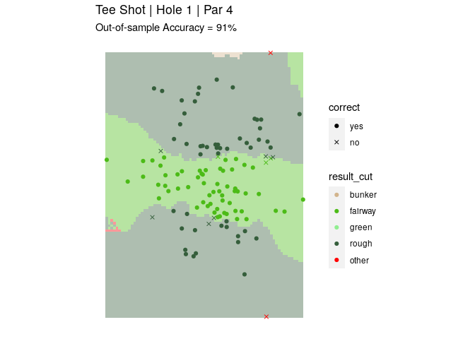<!-- --><!-- -->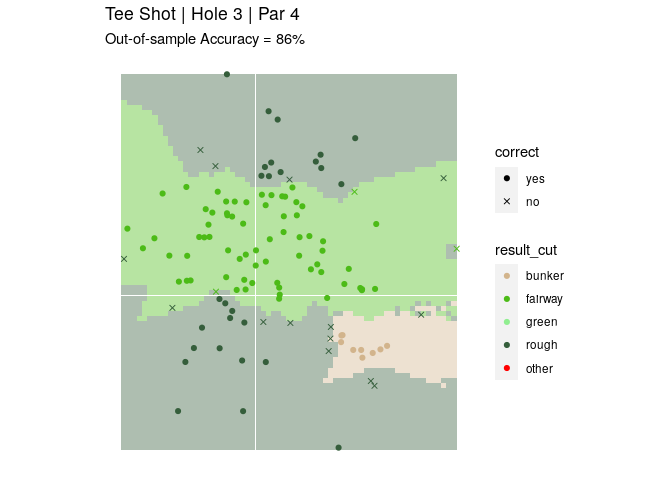<!-- -->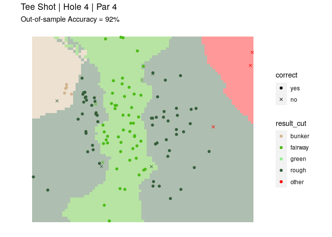<!-- -->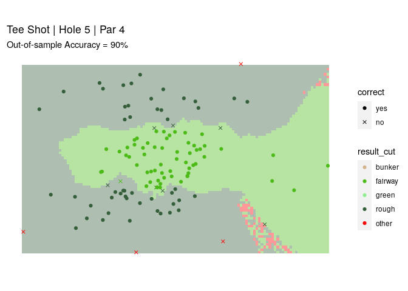<!-- -->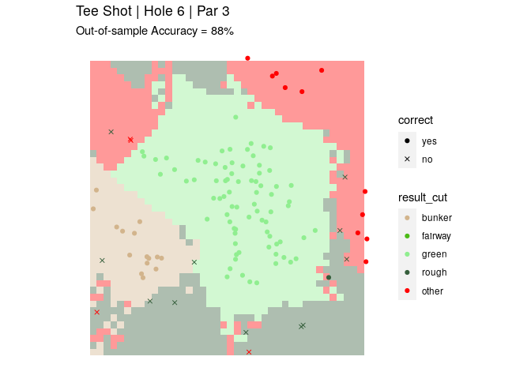<!-- --><!-- -->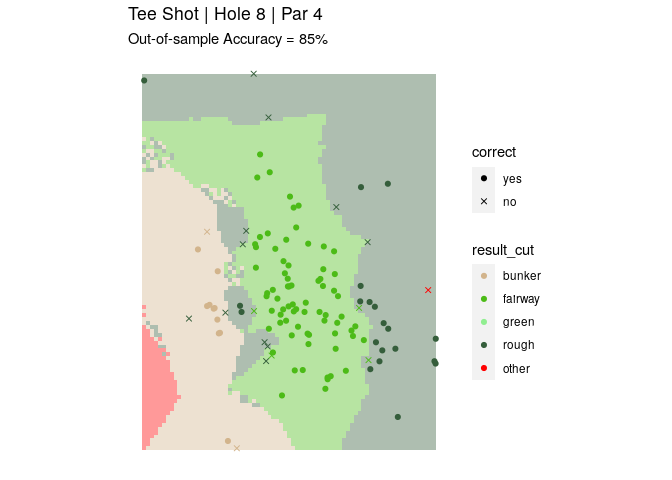<!-- -->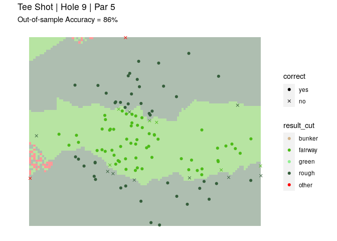<!-- -->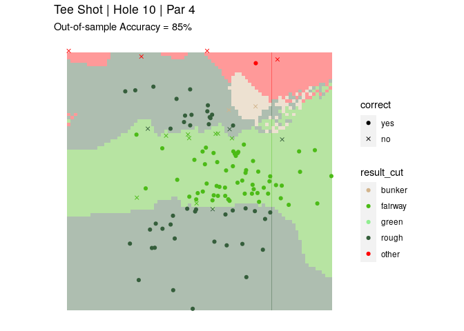<!-- -->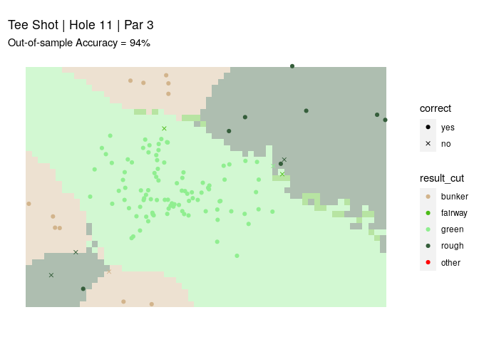<!-- --><!-- -->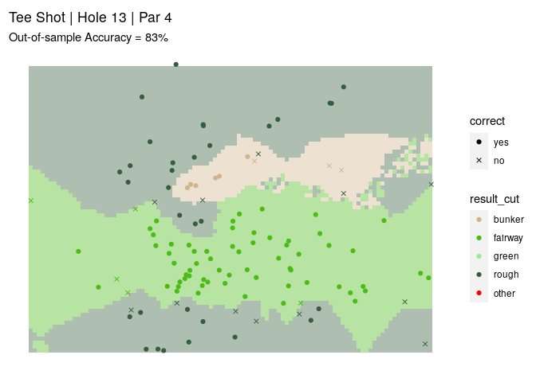<!-- -->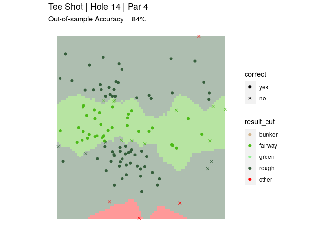<!-- -->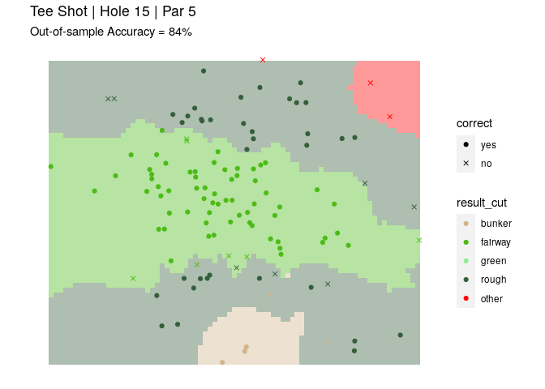<!-- --><!-- --><!-- --><!-- -->
