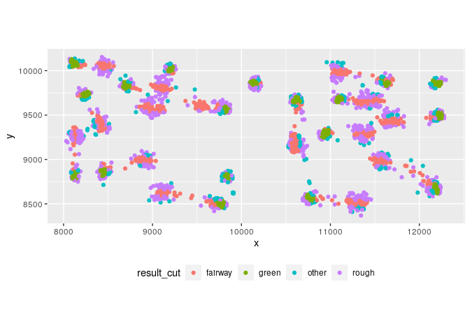

Exploring [PGA
ShotLink](https://www.pgatour.com/stats/shotlinkintelligence/overview.html)
================

``` r
library(tidyverse)

strokes = read_csv(file = "~/project/data/strokes.csv")

intial_plot = strokes %>% 
  mutate(hole = factor(hole, ordered = T)) %>% 
  filter(x > 0) %>% 
  ggplot(mapping = aes(x = x,
                       y = y,
                       color = hole)) +
  geom_point(alpha = 0.25) +
  coord_equal() +
  theme(legend.position = "none",
        plot.background = element_rect(fill = "#161b22"))

intial_plot
```

<!-- -->
